# UBR Automation TestBed

Automation framework for UBR validation with:
- GUI sanity and regression checks through Playwright + Pytest
- Jumbo Frame end-to-end MTU validation
- IXIA and TRex throughput hooks
- Jenkins pipelines for scheduled and parameterized execution

## Tech Stack

- Python 3.10
- `pytest`, `pytest-asyncio`
- `playwright`
- `scrapli`
- `ixnetwork_restpy`
- Jenkins Pipeline (Groovy)

## Project Structure

- `conftest.py`
  Central fixtures and runtime options (`--local-ipv6`, `--remote-ipv6`, `--profile`, `--recovery-profile`, `--allow-destructive-jumbo`, etc.).
- `tests/GUI/`
  GUI test suites:
  - `test_summary.py`
  - `test_topPanel.py`
  - `test_radio_properties.py`
  - `test_network.py`
  - `test_management.py`
  - `test_monitor.py`
- `tests/JumboFrames/`
  Jumbo Frame suite:
  - `test_jumbo_frames.py` (`JMB_01` ... `JMB_10`)
- `traffic/throughput_runner.py`
  Shared throughput entrypoint for IXIA benchmark or TRex stats-check execution.
- `traffic/trex_runner.py`
  Shared TRex session runner abstraction.
- `traffic/trex_stats_check.py`
  Shared lightweight TRex sanity and stats runner.
- `pages/commands.py`
  Shared backend command templates for GUI, monitor, throughput, and network validation.
- `utils/monitor_flows.py`
  Shared Monitor Learn Table and System Logs validation flows for BTS and CPE.
- `profiles/`
  Profile-driven runtime defaults:
  - `default.yaml`
  - `link_formation.yaml`
- `docs/`
  Project documentation, including testcase validation flowcharts.
- `jenkins/jenkins-AutomationFramework`
  Jenkins pipeline for GUI automation.

## Automation Coverage Snapshot

- Total automated product test cases: `55`
- GUI automated cases: `45`
  - Summary: `4`
  - Top Panel: `6`
  - Wireless Properties: `6`
  - Network: `15`
  - Management: `6`
  - Monitor: `8`
- Jumbo Frame automated cases: `10`
- Additional helper or parser tests may exist outside this product-case count, for example `tests/Throughput/test_trex_runner_parser.py`

## What Is Already Done

- Summary page validation flows implemented.
- Top panel validations implemented.
- Radio properties lifecycle validations implemented.
- Network validations implemented for IP, fallback, Ethernet, DHCP, and 2.4 GHz DHCP sections.
- Management validations implemented for timezone, NTP, browser-time sync, logging config, temperature logging, and location.
- Monitor validations implemented for Learn Table and System Logs (`GUI_105` through `GUI_112`).
- Jumbo Frame validations implemented in dedicated suite (`tests/JumboFrames`), with destructive cases opt-in.
- Consolidated fixtures for SSH + GUI login in `conftest.py`.
- Profile-driven execution and centralized recovery framework integrated.
- Jenkins GUI pipeline available with report publishing and email support.

## Default IPv6 Testbed Configuration

These values are defaulted in profiles and CLI for consistent runs:

- BTS / DUT IPv6: `2401:4900:d0:40d4:0:17b8:0:330`
- CPE IPv6: `2401:4900:d0:40d4::17b8:0:331`
- BTS PC IPv6: `2401:4900:d0:40d4::17b8:0:301`
- CPE PC IPv6: `2401:4900:d0:40d4::17b8:0:302`

## Implemented GUI Test Case Index

### Summary

- `GUI_01` - Summary System
- `GUI_02` - Summary Network
- `GUI_03` - Summary Performance
- `GUI_04` - Summary Wireless

### Top Panel

- `GUI_05` - Top Panel Logo
- `GUI_06` - Top Panel Parameters
- `GUI_07` - Top Panel Radio Redirect
- `GUI_08` - Home and Apply Buttons
- `GUI_09` - Reboot Device
- `GUI_10` - Logout

### Wireless Properties

- `GUI_17` - Radio Status
- `GUI_18` - SSID
- `GUI_19` - Bandwidth
- `GUI_20` - Channel
- `GUI_21` - Encryption
- `GUI_22` - Max CPE

### Network

- `GUI_50` - Network IP Configuration
- `GUI_51` - Edit IP Configuration
- `GUI_52` - Edit Netmask Configuration
- `GUI_53` - Edit Gateway Configuration
- `GUI_54` - Edit Fallback IP
- `GUI_55` - Edit Fallback Netmask
- `GUI_70` - Ethernet Speed and Duplex
- `GUI_71` - Ethernet MTU
- `GUI_72` - DHCP Server Status
- `GUI_73` - DHCP Lease Time
- `GUI_74` - DHCP 2.4 GHz Radio IP
- `GUI_75` - DHCP 2.4 GHz Radio Netmask
- `GUI_76` - DHCP 2.4 GHz Radio DHCP Status
- `GUI_77` - DHCP 2.4 GHz Radio Pool Range
- `GUI_78` - DHCP 2.4 GHz Radio Lease Time

### Management

- `GUI_88` - Management Timezone Random Validation
- `GUI_89` - Management NTP Full Cycle
- `GUI_90` - Sync with Browser Time
- `GUI_91` - Management Logging IP and Port
- `GUI_92` - Management Temperature Logging Cycle
- `GUI_93` - Management Location Configuration

### Monitor

- `GUI_105` - Monitor Learn Table Bridge Table
- `GUI_106` - Monitor Learn Table Bridge Refresh and Clear
- `GUI_107` - Monitor Learn Table ARP Table
- `GUI_108` - Monitor Learn Table ARP Refresh and Clear
- `GUI_109` - Monitor System Logs Config Logs and Refresh
- `GUI_110` - Monitor System Logs Device Logs and Refresh
- `GUI_111` - Monitor System Logs Temperature Logs, Refresh, and Clear
- `GUI_112` - Monitor System Logs System Logs and Refresh

GUI execution status: `GUI_01` through `GUI_112` for the implemented coverage above are automated and validated.

## Implemented Jumbo Test Case Index

- `JMB_01` - Configure Jumbo and disable back to default
- `JMB_02` - Configure MTU 9000
- `JMB_03` - Min and mid MTU cycle with ICMP validation
- `JMB_04` - Max MTU 9000 with ICMP validation
- `JMB_05` - Jumbo with management VLAN and interface checks
- `JMB_06` - Jumbo MTU 9000 with P2MP validation
- `JMB_07` - Reboot persistence (`destructive`, gated)
- `JMB_08` - MTU 1500 validation
- `JMB_09` - Boundary and invalid MTU validation
- `JMB_10` - Factory reset default MTU (`destructive`, gated)

Jumbo execution status: `JMB_01` through `JMB_10` are automated and validated.

## Documentation

- Detailed testcase validation flowcharts: `docs/testcase-validation-flows.md`
- Use the `docs/` folder for long-form execution notes, validation references, and future environment-specific documentation.

## Throughput Automation

- Shared throughput entrypoint is `traffic/throughput_runner.py`.
- Supports traffic modes via ratios:
  - Downlink (`100:0`)
  - Uplink (`0:100`)
  - Bidirectional (`80:20` and other ratios)
- Supports IXIA benchmark execution and TRex stats-check execution.
- Collects throughput, latency, loss, and telemetry output for Jenkins artifacts.
- Generates IXIA PDF output from Python-driven runs.
- MCS iteration applies backend settings per loop using command helpers:
  - disable DDRS
  - set spatial stream
  - set DDRS rate
  - apply
  - remote apply for connected SU

## Scripts You Can Run

### GUI suites

Create environment and install dependencies:

```bash
python3.10 -m venv venv
venv/bin/pip install --upgrade pip
venv/bin/pip install -r requirements.txt pytest-check pytest-json-report
venv/bin/playwright install chromium
```

Run full GUI suite:

```bash
venv/bin/python -m pytest tests/GUI/ -v
```

Run only Monitor suite:

```bash
venv/bin/python -m pytest tests/GUI/test_monitor.py -v
```

Run Jumbo Frame suite:

```bash
venv/bin/python -m pytest tests/JumboFrames/ -v
```

Run only Summary suite:

```bash
venv/bin/python -m pytest tests/GUI/ -v -k "Summary"
```

Run only Top Panel suite:

```bash
venv/bin/python -m pytest tests/GUI/ -v -k "TopPanel"
```

Run only Wireless Properties suite:

```bash
venv/bin/python -m pytest tests/GUI/ -v -k "WirelessProperties"
```

Run with custom DUT details:

```bash
venv/bin/python -m pytest tests/GUI/ -v \
  --local-ipv6 2401:4900:d0:40d4:0:17b8:0:330 \
  --remote-ipv6 2401:4900:d0:40d4::17b8:0:331 \
  --username root \
  --password "Sen@0ubRNwk$"
```

Run destructive Jumbo cases:

```bash
venv/bin/python -m pytest tests/JumboFrames/test_jumbo_frames.py -v \
  --allow-destructive-jumbo \
  -k "JMB_07 or JMB_10"
```

### Throughput script

```bash
python3.10 traffic/throughput_runner.py \
  --mode keep \
  --cpes 16 \
  --target 800 \
  --ratio 80:20 \
  --time 15 \
  --ixia-ip 10.0.150.50 \
  --local-ip 2401:4900:d0:40d4:0:17b8:0:330 \
  --packet-size imix \
  --bandwidth HT80 \
  --mcs-rate MCS7 \
  --spatial-stream 2 \
  --ddrs-rate MCS7 \
  --radio-index 1 \
  --output-json current_ixia_run.json \
  --profile default \
  --recovery-profile link_formation \
  --traffic-mode benchmark
```

Notes:
- `--target` is treated as aggregate throughput across all CPEs.
- Ratio split is applied first, then divided by CPE count.
- Example: `800` with `80:20` and `16` CPE gives `640 DL / 160 UL`, so per-CPE is `40 / 10`.

## Jenkins Pipelines

### GUI Pipeline

- File: `jenkins/jenkins-AutomationFramework`
- Purpose: execute GUI tests by filter and publish customer reports.

Key parameters:
- `TEST_FILTER`
- `Local IPv6 Address`
- `PROFILE_NAME`
- `RECOVERY_PROFILE_NAME`
- `ENABLE_DESTRUCTIVE_JUMBO`

Jumbo from Jenkins examples:

```text
TEST_FILTER=JumboFrames
ENABLE_DESTRUCTIVE_JUMBO=false
```

```text
TEST_FILTER=JMB_07 or JMB_10
ENABLE_DESTRUCTIVE_JUMBO=true
```

## Current Status

- Core GUI automation: stable and runnable.
- Monitor automation: `GUI_105` through `GUI_112` implemented and passing.
- Jumbo automation: `JMB_01` through `JMB_10` implemented and runnable, with destructive cases gated.
- Throughput automation: implemented and runnable with IXIA/TRex hooks.
- Jenkins integration: in place for GUI use-cases.

## Work In Progress

- Full command centralization cleanup for remaining hardcoded commands.
- Throughput report polish for large matrix readability.
- Pipeline guardrails for unsupported bandwidth and MCS combinations.
- Environment prerequisite documentation for lab reservations and firmware assumptions.

## Known Notes

- There are two similarly named GUI pipeline files (`jenkins-AutomationFramework` and `jenkins_AutomationFramework`); standardize to one active file to avoid confusion.
- GUI pipeline expects `TARGET_STAND` to be available in Jenkins environment.
- Factory reset and profile-restore flows depend on DUT boot timing; use the destructive toggle only when the bench is reserved.
# UBR Automation TestBed

Automation framework for UBR validation with:
- GUI sanity and regression checks through Playwright + Pytest
- Jumbo Frame end-to-end MTU validation
- IXIA and TRex throughput hooks
- Jenkins pipelines for scheduled and parameterized execution

## Tech Stack

- Python 3.10
- `pytest`, `pytest-asyncio`
- `playwright`
- `scrapli`
- `ixnetwork_restpy`
- Jenkins Pipeline (Groovy)

## Project Structure

- `conftest.py`
  Central fixtures and runtime options (`--local-ipv6`, `--remote-ipv6`, `--profile`, `--recovery-profile`, `--allow-destructive-jumbo`, etc.).
- `tests/GUI/`
  GUI test suites:
  - `test_summary.py`
  - `test_topPanel.py`
  - `test_radio_properties.py`
  - `test_network.py`
  - `test_management.py`
  - `test_monitor.py`
- `tests/JumboFrames/`
  Jumbo Frame suite:
  - `test_jumbo_frames.py` (`JMB_01` ... `JMB_10`)
- `traffic/throughput_runner.py`
  Shared throughput entrypoint for IXIA benchmark or TRex stats-check execution.
- `traffic/trex_runner.py`
  Shared TRex session runner abstraction.
- `traffic/trex_stats_check.py`
  Shared lightweight TRex sanity and stats runner.
- `profiles/`
  Profile-driven runtime defaults:
  - `default.yaml`
  - `link_formation.yaml`
- `pages/commands.py`
  Shared backend command templates for GUI, monitor, throughput, and network validation.
- `utils/monitor_flows.py`
  Shared Monitor Learn Table and System Logs validation flows for BTS and CPE.
- `utils/profile_manager.py`
  Profile loading, validation, and CLI override merge.
- `utils/recovery_manager.py`
  Shared link health checks and recovery metrics tracking.
- `jenkins/jenkins-AutomationFramework`
  Jenkins pipeline for GUI automation.

## Automation Coverage Snapshot

- Total automated product test cases: `55`
- GUI automated cases: `45`
  - Summary: `4`
  - Top Panel: `6`
  - Wireless Properties: `6`
  - Network: `15`
  - Management: `6`
  - Monitor: `8`
- Jumbo Frame automated cases: `10`
- Additional helper/unit tests exist outside this product-case count, for example `tests/Throughput/test_trex_runner_parser.py`

## What Is Already Done

- Summary page validation flows implemented.
- Top panel validations implemented.
- Radio properties lifecycle validations implemented.
- Network validations implemented for IP, fallback, Ethernet, DHCP, and 2.4 GHz DHCP sections.
- Management validations implemented for timezone, NTP, browser-time sync, logging config, temperature logging, and location.
- Monitor validations implemented for Learn Table and System Logs (`GUI_105` through `GUI_112`).
- Jumbo Frame validations implemented in dedicated suite (`tests/JumboFrames`), with destructive cases opt-in.
- Consolidated fixtures for SSH + GUI login in `conftest.py`.
- Profile-driven execution and centralized recovery framework integrated.
- Jenkins GUI pipeline available with report publishing and email support.

## Default IPv6 Testbed Configuration

These values are defaulted in profiles and CLI for consistent runs:

- BTS / DUT IPv6: `2401:4900:d0:40d4:0:17b8:0:330`
- CPE IPv6: `2401:4900:d0:40d4::17b8:0:331`
- BTS PC IPv6: `2401:4900:d0:40d4::17b8:0:301`
- CPE PC IPv6: `2401:4900:d0:40d4::17b8:0:302`

## Implemented GUI Test Case Index

### Summary

- `GUI_01` - Summary System
- `GUI_02` - Summary Network
- `GUI_03` - Summary Performance
- `GUI_04` - Summary Wireless

### Top Panel

- `GUI_05` - Top Panel Logo
- `GUI_06` - Top Panel Parameters
- `GUI_07` - Top Panel Radio Redirect
- `GUI_08` - Home and Apply Buttons
- `GUI_09` - Reboot Device
- `GUI_10` - Logout

### Wireless Properties

- `GUI_17` - Radio Status
- `GUI_18` - SSID
- `GUI_19` - Bandwidth
- `GUI_20` - Channel
- `GUI_21` - Encryption
- `GUI_22` - Max CPE

### Network

- `GUI_50` - Network IP Configuration
- `GUI_51` - Edit IP Configuration
- `GUI_52` - Edit Netmask Configuration
- `GUI_53` - Edit Gateway Configuration
- `GUI_54` - Edit Fallback IP
- `GUI_55` - Edit Fallback Netmask
- `GUI_70` - Ethernet Speed and Duplex
- `GUI_71` - Ethernet MTU
- `GUI_72` - DHCP Server Status
- `GUI_73` - DHCP Lease Time
- `GUI_74` - DHCP 2.4 GHz Radio IP
- `GUI_75` - DHCP 2.4 GHz Radio Netmask
- `GUI_76` - DHCP 2.4 GHz Radio DHCP Status
- `GUI_77` - DHCP 2.4 GHz Radio Pool Range
- `GUI_78` - DHCP 2.4 GHz Radio Lease Time

### Management

- `GUI_88` - Management Timezone Random Validation
- `GUI_89` - Management NTP Full Cycle
- `GUI_90` - Sync with Browser Time
- `GUI_91` - Management Logging IP and Port
- `GUI_92` - Management Temperature Logging Cycle
- `GUI_93` - Management Location Configuration

### Monitor

- `GUI_105` - Monitor Learn Table Bridge Table
- `GUI_106` - Monitor Learn Table Bridge Refresh and Clear
- `GUI_107` - Monitor Learn Table ARP Table
- `GUI_108` - Monitor Learn Table ARP Refresh and Clear
- `GUI_109` - Monitor System Logs Config Logs and Refresh
- `GUI_110` - Monitor System Logs Device Logs and Refresh
- `GUI_111` - Monitor System Logs Temperature Logs, Refresh, and Clear
- `GUI_112` - Monitor System Logs System Logs and Refresh

GUI execution status: `GUI_01` through `GUI_112` for the implemented coverage above are automated and validated.

## Implemented Jumbo Test Case Index

- `JMB_01` - Configure Jumbo and disable back to default
- `JMB_02` - Configure MTU 9000
- `JMB_03` - Min and mid MTU cycle with ICMP validation
- `JMB_04` - Max MTU 9000 with ICMP validation
- `JMB_05` - Jumbo with management VLAN and interface checks
- `JMB_06` - Jumbo MTU 9000 with P2MP validation
- `JMB_07` - Reboot persistence (`destructive`, gated)
- `JMB_08` - MTU 1500 validation
- `JMB_09` - Boundary and invalid MTU validation
- `JMB_10` - Factory reset default MTU (`destructive`, gated)

Jumbo execution status: `JMB_01` through `JMB_10` are automated and validated.

## Validation Flowcharts

The flowcharts below describe how each automated test case is validated in the framework.

### Summary Flowcharts

<details>
<summary><code>GUI_01</code> Summary System</summary>


</details>

<details>
<summary><code>GUI_02</code> Summary Network</summary>

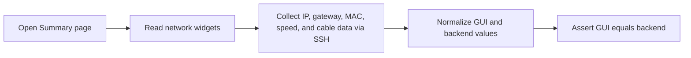

</details>

<details>
<summary><code>GUI_03</code> Summary Performance</summary>


</details>

<details>
<summary><code>GUI_04</code> Summary Wireless</summary>

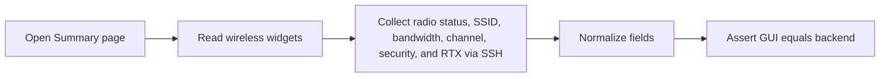

</details>

### Top Panel Flowcharts

<details>
<summary><code>GUI_05</code> Top Panel Logo</summary>


</details>

<details>
<summary><code>GUI_06</code> Top Panel Parameters</summary>

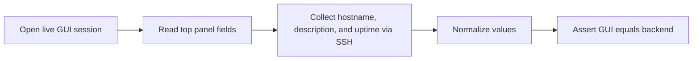

</details>

<details>
<summary><code>GUI_07</code> Top Panel Radio Redirect</summary>


</details>

<details>
<summary><code>GUI_08</code> Home and Apply Buttons</summary>

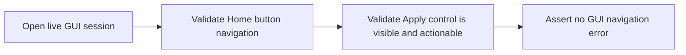

</details>

<details>
<summary><code>GUI_09</code> Reboot Device</summary>


</details>

<details>
<summary><code>GUI_10</code> Logout</summary>


</details>

### Wireless Properties Flowcharts

<details>
<summary><code>GUI_17</code> Radio Status</summary>


</details>

<details>
<summary><code>GUI_18</code> SSID</summary>

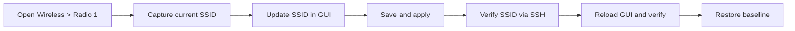

</details>

<details>
<summary><code>GUI_19</code> Bandwidth</summary>

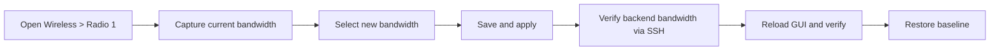

</details>

<details>
<summary><code>GUI_20</code> Channel</summary>

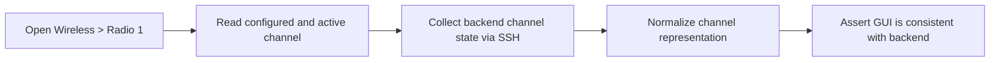

</details>

<details>
<summary><code>GUI_21</code> Encryption</summary>

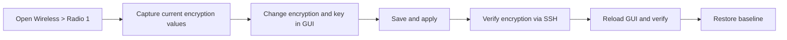

</details>

<details>
<summary><code>GUI_22</code> Max CPE</summary>

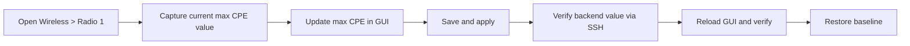

</details>

### Network Flowcharts

<details>
<summary><code>GUI_50</code> Network IP Configuration</summary>


</details>

<details>
<summary><code>GUI_51</code> Edit IP Configuration</summary>


</details>

<details>
<summary><code>GUI_52</code> Edit Netmask Configuration</summary>

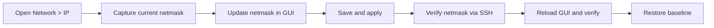

</details>

<details>
<summary><code>GUI_53</code> Edit Gateway Configuration</summary>

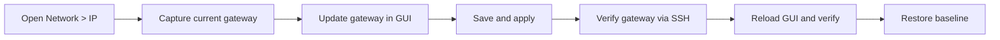

</details>

<details>
<summary><code>GUI_54</code> Edit Fallback IP</summary>

```mermaid
flowchart LR
    A[Open Network > IP] --> B[Capture current fallback IP]
    B --> C[Update fallback IP in GUI]
    C --> D[Save and apply]
    D --> E[Verify fallback IP via SSH]
    E --> F[Reload GUI and verify]
    F --> G[Restore baseline]
```

</details>

<details>
<summary><code>GUI_55</code> Edit Fallback Netmask</summary>

```mermaid
flowchart LR
    A[Open Network > IP] --> B[Capture current fallback netmask]
    B --> C[Update fallback netmask in GUI]
    C --> D[Save and apply]
    D --> E[Verify fallback netmask via SSH]
    E --> F[Reload GUI and verify]
    F --> G[Restore baseline]
```

</details>

<details>
<summary><code>GUI_70</code> Ethernet Speed and Duplex</summary>

```mermaid
flowchart LR
    A[Open Network > Ethernet] --> B[Capture current speed and duplex]
    B --> C[Update speed and duplex in GUI]
    C --> D[Save and apply]
    D --> E[Verify Ethernet backend values via SSH]
    E --> F[Reload GUI and verify]
    F --> G[Restore baseline]
```

</details>

<details>
<summary><code>GUI_71</code> Ethernet MTU</summary>

```mermaid
flowchart LR
    A[Open Network > Ethernet] --> B[Capture current MTU]
    B --> C[Update MTU in GUI]
    C --> D[Save and apply]
    D --> E[Verify backend MTU via SSH]
    E --> F[Reload GUI and verify]
    F --> G[Restore baseline]
```

</details>

<details>
<summary><code>GUI_72</code> DHCP Server Status</summary>

```mermaid
flowchart LR
    A[Open Network > DHCP] --> B[Capture current DHCP status]
    B --> C[Toggle DHCP server state]
    C --> D[Save and apply]
    D --> E[Verify DHCP setting via SSH]
    E --> F[Reload GUI and verify]
    F --> G[Restore baseline]
```

</details>

<details>
<summary><code>GUI_73</code> DHCP Lease Time</summary>

```mermaid
flowchart LR
    A[Open Network > DHCP] --> B[Capture current lease time]
    B --> C[Update lease time in GUI]
    C --> D[Save and apply]
    D --> E[Verify lease time via SSH]
    E --> F[Reload GUI and verify]
    F --> G[Restore baseline]
```

</details>

<details>
<summary><code>GUI_74</code> DHCP 2.4 GHz Radio IP</summary>

```mermaid
flowchart LR
    A[Open Network > DHCP 2.4 GHz tab] --> B[Capture current radio IP]
    B --> C[Update radio IP in GUI]
    C --> D[Save and apply]
    D --> E[Verify backend value via SSH]
    E --> F[Reload GUI and verify]
    F --> G[Restore baseline]
```

</details>

<details>
<summary><code>GUI_75</code> DHCP 2.4 GHz Radio Netmask</summary>

```mermaid
flowchart LR
    A[Open Network > DHCP 2.4 GHz tab] --> B[Capture current radio netmask]
    B --> C[Update radio netmask in GUI]
    C --> D[Save and apply]
    D --> E[Verify backend value via SSH]
    E --> F[Reload GUI and verify]
    F --> G[Restore baseline]
```

</details>

<details>
<summary><code>GUI_76</code> DHCP 2.4 GHz Radio DHCP Status</summary>

```mermaid
flowchart LR
    A[Open Network > DHCP 2.4 GHz tab] --> B[Capture current DHCP state]
    B --> C[Toggle DHCP status]
    C --> D[Save and apply]
    D --> E[Verify backend value via SSH]
    E --> F[Reload GUI and verify]
    F --> G[Restore baseline]
```

</details>

<details>
<summary><code>GUI_77</code> DHCP 2.4 GHz Radio Pool Range</summary>

```mermaid
flowchart LR
    A[Open Network > DHCP 2.4 GHz tab] --> B[Capture pool start and limit]
    B --> C[Update pool range in GUI]
    C --> D[Save and apply]
    D --> E[Verify backend values via SSH]
    E --> F[Reload GUI and verify]
    F --> G[Restore baseline]
```

</details>

<details>
<summary><code>GUI_78</code> DHCP 2.4 GHz Radio Lease Time</summary>

```mermaid
flowchart LR
    A[Open Network > DHCP 2.4 GHz tab] --> B[Capture current lease time]
    B --> C[Update lease time in GUI]
    C --> D[Save and apply]
    D --> E[Verify backend value via SSH]
    E --> F[Reload GUI and verify]
    F --> G[Restore baseline]
```

</details>

### Management Flowcharts

<details>
<summary><code>GUI_88</code> Management Timezone Random Validation</summary>

```mermaid
flowchart LR
    A[Open Management > System] --> B[Capture current timezone]
    B --> C[Pick alternate timezone]
    C --> D[Save and apply]
    D --> E[Verify timezone via SSH]
    E --> F[Reload GUI and verify]
    F --> G[Restore baseline]
```

</details>

<details>
<summary><code>GUI_89</code> Management NTP Full Cycle</summary>

```mermaid
flowchart LR
    A[Open Management > System] --> B[Read current NTP server list]
    B --> C[Add new NTP server]
    C --> D[Save and apply]
    D --> E[Verify via SSH]
    E --> F[Delete added server and reapply]
    F --> G[Verify cleanup]
```

</details>

<details>
<summary><code>GUI_90</code> Sync with Browser Time</summary>

```mermaid
flowchart LR
    A[Open Management > System] --> B[Trigger browser time sync]
    B --> C[Save and apply]
    C --> D[Read device time via SSH]
    D --> E[Compare device time with browser time window]
```

</details>

<details>
<summary><code>GUI_91</code> Management Logging IP and Port</summary>

```mermaid
flowchart LR
    A[Open Management > Logging] --> B[Capture current log IP and port]
    B --> C[Update logging destination]
    C --> D[Save and apply]
    D --> E[Verify backend config via SSH]
    E --> F[Reload GUI and verify]
    F --> G[Restore baseline]
```

</details>

<details>
<summary><code>GUI_92</code> Management Temperature Logging Cycle</summary>

```mermaid
flowchart LR
    A[Open Management > Logging] --> B[Capture temp logging settings]
    B --> C[Enable or update temp logging interval]
    C --> D[Save and apply]
    D --> E[Verify backend config and generated temp logs]
    E --> F[Reload GUI and verify]
    F --> G[Restore baseline]
```

</details>

<details>
<summary><code>GUI_93</code> Management Location Configuration</summary>

```mermaid
flowchart LR
    A[Open Management > Location] --> B[Capture current location fields]
    B --> C[Update location details in GUI]
    C --> D[Save and apply]
    D --> E[Verify backend values via SSH]
    E --> F[Reload GUI and verify]
    F --> G[Restore baseline]
```

</details>

### Monitor Flowcharts

<details>
<summary><code>GUI_105</code> Monitor Learn Table Bridge Table</summary>

```mermaid
flowchart LR
    A[Open Monitor > Learn Table > Bridge] --> B[Read GUI bridge entries for BTS and CPE]
    B --> C[Collect bridge FDB via SSH]
    C --> D[Normalize MAC, interface, and ageing values]
    D --> E[Assert GUI equals backend with no duplicates]
```

</details>

<details>
<summary><code>GUI_106</code> Monitor Learn Table Bridge Refresh and Clear</summary>

```mermaid
flowchart LR
    A[Open Monitor > Learn Table > Bridge] --> B[Capture baseline bridge entries]
    B --> C[Click Refresh and wait for GUI to match backend]
    C --> D[Click Clear]
    D --> E[Wait for relearn behavior]
    E --> F[Assert current active entries repopulate correctly]
```

</details>

<details>
<summary><code>GUI_107</code> Monitor Learn Table ARP Table</summary>

```mermaid
flowchart LR
    A[Open Monitor > Learn Table > ARP] --> B[Read GUI ARP entries for BTS and CPE]
    B --> C[Collect ARP entries via SSH]
    C --> D[Normalize MAC, interface, and IP values]
    D --> E[Assert GUI equals backend with no duplicates]
```

</details>

<details>
<summary><code>GUI_108</code> Monitor Learn Table ARP Refresh and Clear</summary>

```mermaid
flowchart LR
    A[Open Monitor > Learn Table > ARP] --> B[Capture baseline ARP entries]
    B --> C[Click Refresh and wait for GUI to match backend]
    C --> D[Click Clear]
    D --> E[Wait for relearn behavior]
    E --> F[Assert current active entries repopulate correctly]
```

</details>

<details>
<summary><code>GUI_109</code> Monitor System Logs Config Logs and Refresh</summary>

```mermaid
flowchart LR
    A[Open Management > System] --> B[Change timezone as reversible config action]
    B --> C[Save and apply]
    C --> D[Open Monitor > System Logs > Config]
    D --> E[Refresh logs]
    E --> F[Match GUI log with config log backend source]
    F --> G[Restore baseline timezone]
```

</details>

<details>
<summary><code>GUI_110</code> Monitor System Logs Device Logs and Refresh</summary>

```mermaid
flowchart LR
    A[Open Monitor > System Logs > Device] --> B[Read GUI device logs for BTS and CPE]
    B --> C[Collect device log file via SSH]
    C --> D[Refresh logs]
    D --> E[Assert GUI matches backend device log source]
```

</details>

<details>
<summary><code>GUI_111</code> Monitor System Logs Temperature Logs, Refresh, and Clear</summary>

```mermaid
flowchart LR
    A[Open Monitor > System Logs > Temperature] --> B[Read GUI temperature logs]
    B --> C[Collect temp log file via SSH]
    C --> D[Refresh and assert GUI equals backend]
    D --> E[Clear logs]
    E --> F[Refresh and assert log source is empty]
```

</details>

<details>
<summary><code>GUI_112</code> Monitor System Logs System Logs and Refresh</summary>

```mermaid
flowchart LR
    A[Open Monitor > System Logs > System] --> B[Inject safe log marker through SSH]
    B --> C[Refresh GUI logs]
    C --> D[Read logread backend source]
    D --> E[Assert marker appears in backend and GUI]
```

</details>

### Jumbo Frame Flowcharts

<details>
<summary><code>JMB_01</code> Configure Jumbo and disable back to default</summary>

```mermaid
flowchart LR
    A[Open Network > Ethernet] --> B[Set non-default jumbo MTU]
    B --> C[Save and apply]
    C --> D[Verify backend MTU via SSH]
    D --> E[Set MTU back to default]
    E --> F[Verify GUI and backend return to baseline]
```

</details>

<details>
<summary><code>JMB_02</code> Configure MTU 9000</summary>

```mermaid
flowchart LR
    A[Open BTS and CPE Ethernet settings] --> B[Set MTU 9000]
    B --> C[Save and apply]
    C --> D[Verify backend MTU values via SSH]
    D --> E[Assert GUI reflects MTU 9000]
```

</details>

<details>
<summary><code>JMB_03</code> Min and mid MTU cycle with ICMP validation</summary>

```mermaid
flowchart LR
    A[Iterate min and mid MTU values] --> B[Apply same MTU on BTS and CPE]
    B --> C[Verify backend MTU via SSH]
    C --> D[Run device-to-device ICMP payload check]
    D --> E[Assert ping success for each MTU]
```

</details>

<details>
<summary><code>JMB_04</code> Max MTU 9000 with ICMP validation</summary>

```mermaid
flowchart LR
    A[Set BTS and CPE MTU to 9000] --> B[Save and apply]
    B --> C[Verify backend MTU via SSH]
    C --> D[Run device-to-device jumbo ICMP validation]
    D --> E[Assert ping success at MTU 9000]
```

</details>

<details>
<summary><code>JMB_05</code> Jumbo with management VLAN and interface checks</summary>

```mermaid
flowchart LR
    A[Apply jumbo MTU in management path] --> B[Save and apply]
    B --> C[Verify relevant interface and config state via SSH]
    C --> D[Check GUI reflects updated management-side MTU state]
    D --> E[Restore baseline if needed]
```

</details>

<details>
<summary><code>JMB_06</code> Jumbo MTU 9000 with P2MP validation</summary>

```mermaid
flowchart LR
    A[Set jumbo MTU on P2MP path] --> B[Verify BTS and CPE backend MTU]
    B --> C[Run device-to-device ICMP validation]
    C --> D[Assert jumbo traffic passes on active link]
```

</details>

<details>
<summary><code>JMB_07</code> Reboot persistence</summary>

```mermaid
flowchart LR
    A[Set jumbo MTU on target interfaces] --> B[Save and apply]
    B --> C[Trigger reboot]
    C --> D[Recover GUI and SSH session]
    D --> E[Re-read MTU via GUI and SSH]
    E --> F[Assert MTU persisted after reboot]
```

</details>

<details>
<summary><code>JMB_08</code> MTU 1500 validation</summary>

```mermaid
flowchart LR
    A[Set BTS and CPE MTU to 1500] --> B[Save and apply]
    B --> C[Verify backend MTU via SSH]
    C --> D[Assert GUI reflects 1500]
    D --> E[Confirm default MTU behavior is restored]
```

</details>

<details>
<summary><code>JMB_09</code> Boundary and invalid MTU validation</summary>

```mermaid
flowchart LR
    A[Try valid boundary MTU values] --> B[Verify accept path]
    B --> C[Try invalid MTU values]
    C --> D[Verify GUI validation or backend rejection]
    D --> E[Assert device remains on valid state]
```

</details>

<details>
<summary><code>JMB_10</code> Factory reset default MTU</summary>

```mermaid
flowchart LR
    A[Set non-default jumbo MTU] --> B[Save and apply]
    B --> C[Trigger factory reset]
    C --> D[Recover device session and default GUI access]
    D --> E[Read MTU via GUI and SSH]
    E --> F[Assert MTU returned to factory default]
```

</details>

## Throughput Automation

- Shared throughput entrypoint is `traffic/throughput_runner.py`.
- Supports traffic modes via ratios:
  - Downlink (`100:0`)
  - Uplink (`0:100`)
  - Bidirectional (`80:20` and other ratios)
- Supports IXIA benchmark execution and TRex stats-check execution.
- Collects throughput, latency, loss, and telemetry output for Jenkins artifacts.
- Generates IXIA PDF output from Python-driven runs.
- MCS iteration applies backend settings per loop using command helpers:
  - disable DDRS
  - set spatial stream
  - set DDRS rate
  - apply
  - remote apply for connected SU

## Scripts You Can Run

### GUI suites

Create environment and install dependencies:

```bash
python3.10 -m venv venv
venv/bin/pip install --upgrade pip
venv/bin/pip install -r requirements.txt pytest-check pytest-json-report
venv/bin/playwright install chromium
```

Run full GUI suite:

```bash
venv/bin/python -m pytest tests/GUI/ -v
```

Run only Monitor suite:

```bash
venv/bin/python -m pytest tests/GUI/test_monitor.py -v
```

Run Jumbo Frame suite:

```bash
venv/bin/python -m pytest tests/JumboFrames/ -v
```

Run only Summary suite:

```bash
venv/bin/python -m pytest tests/GUI/ -v -k "Summary"
```

Run only Top Panel suite:

```bash
venv/bin/python -m pytest tests/GUI/ -v -k "TopPanel"
```

Run only Wireless Properties suite:

```bash
venv/bin/python -m pytest tests/GUI/ -v -k "WirelessProperties"
```

Run with custom DUT details:

```bash
venv/bin/python -m pytest tests/GUI/ -v \
  --local-ipv6 2401:4900:d0:40d4:0:17b8:0:330 \
  --remote-ipv6 2401:4900:d0:40d4::17b8:0:331 \
  --username root \
  --password "Sen@0ubRNwk$"
```

Run destructive Jumbo cases:

```bash
venv/bin/python -m pytest tests/JumboFrames/test_jumbo_frames.py -v \
  --allow-destructive-jumbo \
  -k "JMB_07 or JMB_10"
```

### Throughput script

```bash
python3.10 traffic/throughput_runner.py \
  --mode keep \
  --cpes 16 \
  --target 800 \
  --ratio 80:20 \
  --time 15 \
  --ixia-ip 10.0.150.50 \
  --local-ip 2401:4900:d0:40d4:0:17b8:0:330 \
  --packet-size imix \
  --bandwidth HT80 \
  --mcs-rate MCS7 \
  --spatial-stream 2 \
  --ddrs-rate MCS7 \
  --radio-index 1 \
  --output-json current_ixia_run.json \
  --profile default \
  --recovery-profile link_formation \
  --traffic-mode benchmark
```

Notes:
- `--target` is treated as aggregate throughput across all CPEs.
- Ratio split is applied first, then divided by CPE count.
- Example: `800` with `80:20` and `16` CPE gives `640 DL / 160 UL`, so per-CPE is `40 / 10`.

## Jenkins Pipelines

### GUI Pipeline

- File: `jenkins/jenkins-AutomationFramework`
- Purpose: execute GUI tests by filter and publish customer reports.

Key parameters:
- `TEST_FILTER`
- `Local IPv6 Address`
- `PROFILE_NAME`
- `RECOVERY_PROFILE_NAME`
- `ENABLE_DESTRUCTIVE_JUMBO`

Jumbo from Jenkins examples:

```text
TEST_FILTER=JumboFrames
ENABLE_DESTRUCTIVE_JUMBO=false
```

```text
TEST_FILTER=JMB_07 or JMB_10
ENABLE_DESTRUCTIVE_JUMBO=true
```

## Current Status

- Core GUI automation: stable and runnable.
- Monitor automation: `GUI_105` through `GUI_112` implemented and passing.
- Jumbo automation: `JMB_01` through `JMB_10` implemented and runnable, with destructive cases gated.
- Throughput automation: implemented and runnable with IXIA/TRex hooks.
- Jenkins integration: in place for GUI use-cases.

## Work In Progress

- Full command centralization cleanup for remaining hardcoded commands.
- Throughput report polish for large matrix readability.
- Pipeline guardrails for unsupported bandwidth and MCS combinations.
- Environment prerequisite documentation for lab reservations and firmware assumptions.

## Known Notes

- There are two similarly named GUI pipeline files (`jenkins-AutomationFramework` and `jenkins_AutomationFramework`); standardize to one active file to avoid confusion.
- GUI pipeline expects `TARGET_STAND` to be available in Jenkins environment.
- Factory reset and profile-restore flows depend on DUT boot timing; use the destructive toggle only when the bench is reserved.

